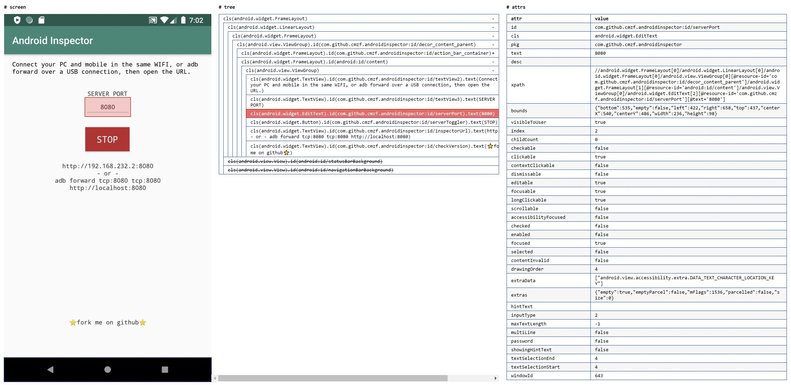
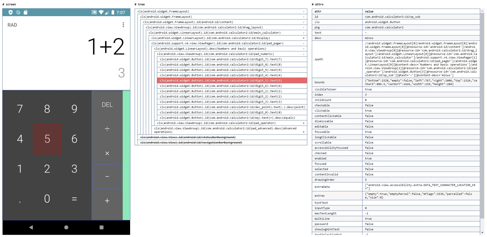
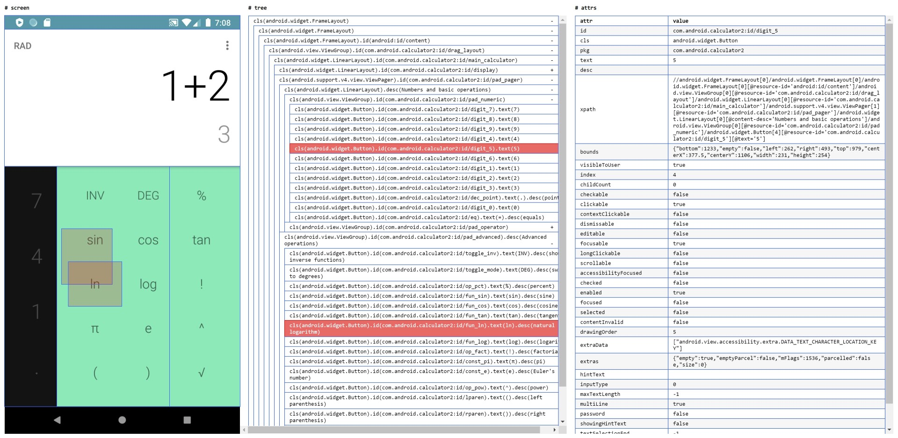

# Android Inspector
A productive UI layout inspector app for Android and Appium, with embed HTTP server, is an alternative to uiautomatorviewer (monitor.bat).

# Usage
1. Download apk from
   [releases page](https://github.com/cmzf/android-inspector/releases),
   and install it.
2. Click "START" button, and grant capture screen and accessibility
   permissions for Inspector.
3. Connect your PC and mobile in the same WIFI, or adb forward over a
   USB connection, then open the URL.

# Screenshots

